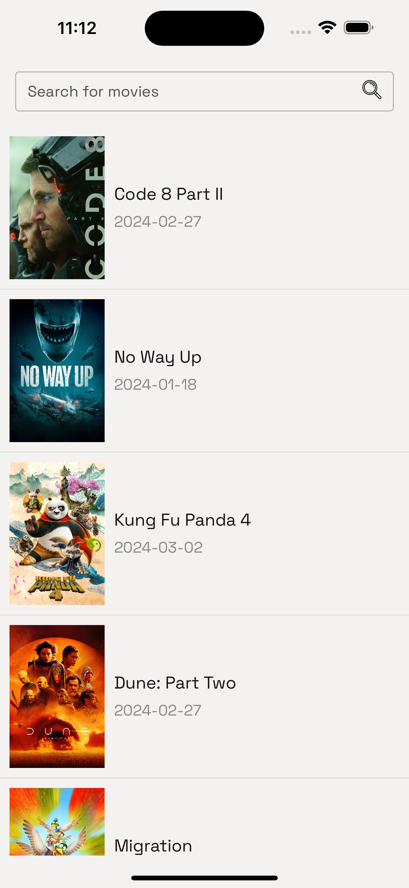
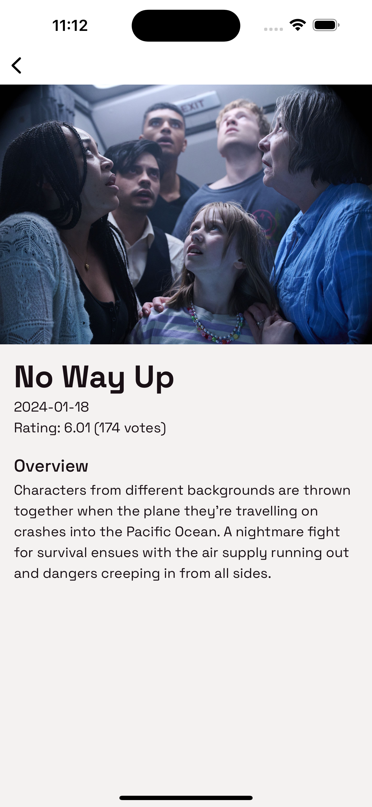
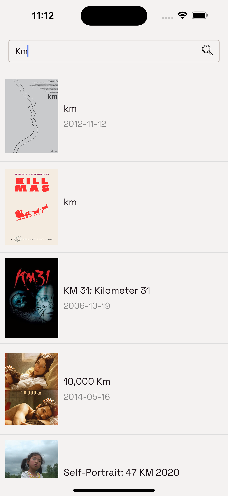
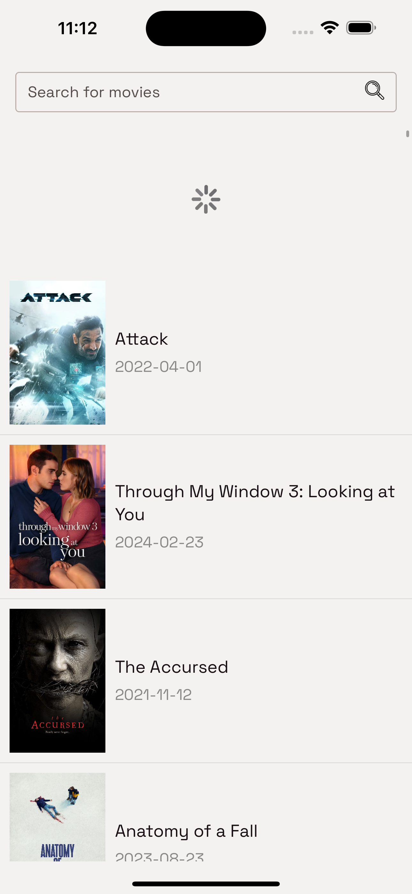
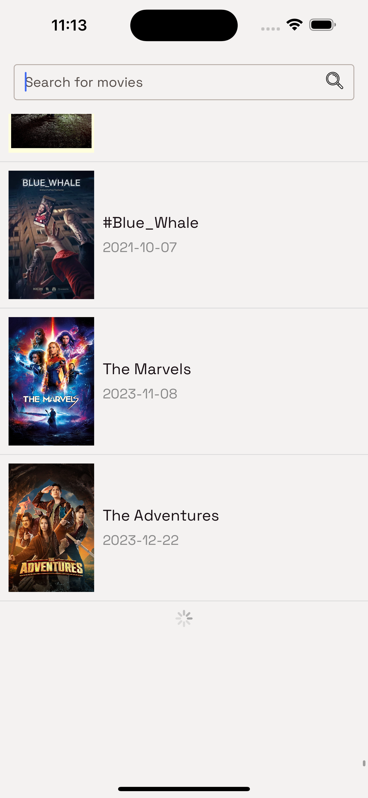

# MovieRn

A react native movie listing app that allows user to view the lising of movies. Functionalities includes:

- Virtualized list
- Detail Screen
- Instant Search
- Pull to refresh
- Pagination via load more
- Error Popup
- Fast Image

### APK

The apk file can be found under the APK folder for quick demo

### Installation

In vscode terminal run:
```sh
yarn install
yarn ios / yarn android
```
<br/>

### Screenshots


Dashboard:<br/>
<br/>

Detail:<br/>
<br/>

Search:<br/>


<br/>

Loading search:<br/>
<br/>

Pull to refresh:<br/>
<br/>

Pagination(load more):<br/>
<br/>

Error:<br/>

